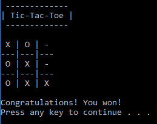

# T3
A Tic-Tac-Toe game done console style.

This is a fun project done just to do something in C++.
The AI isn't very smart, it just selects an open space at random, so the game is fairly beatable.

##### Screenshot

## How to Play
Make sure you have gcc installed. MinGW is a good option if you don't have gcc already.

Run the following command: `g++ -std=c++11 src/main.cpp -o t3.exe`

Then run `t3.exe` to begin playing.

After that, just type in a number 0 through 8 to select a space to place your X. 
